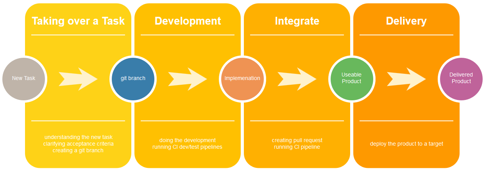
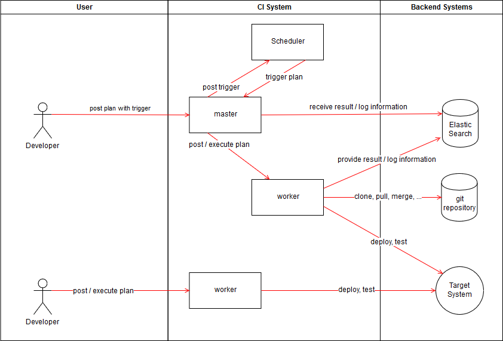

# ci-fish
CI system which is trying to solve different problems for developers using simplifying and swimming in docker bowl

## Project Status
Currently only a collection of ideas.
In case you want to provide any feedback no not hesitate to do so!

## Problems

### The Problems ci-fish is trying to solve
* Many CI systems are hard to install 
* Many CI systems are hard to maintain over the time
* Many CI systems are not supporting developer with their development and delivery process
* Many CI systems are not helping developer to get rid of manual tasks like maintaining changelogs, release notes, etc.
* Many CI systems are becoming a vendor-lock-in
* Many CI systems are hard to run locally 
* Many CI systems are not seperating very well so that pipelines can read other pipelines data
* Many CI systems are dealing this secrets not in a secure manner
* Many CI system are having a lot network interaction with different components using uncommon protocols which makes component seperation hard in case the network traffic needs to cross firewalls. E.g. master and worker/agent interaction

### Ideas how to solve the Problems?
* Using docker to ship the ship the product to ensure it can be easily downloaded, installed and run
* Using docker to seperate pipelines in a secure manner to ensure the processed data cannot be read by other pipelines
* Using yaml files for configuration to ensure it is easy to maintain.
* Using no database to ensure it is simple to restore and behaving as a self contained service.
* Using REST interfaces to ensure it can be easily interfaces and integrated into other tooling
* Using json payload for all interaces to ensure the input/output can be easily processed
* Using (web) hooks to provide information/data to other systems like chatbots, other build systems, etc.
* Using strong encryption to ensure secret, confidential or personal data stay safe.
* Building a system around common development and delivery processes that automates all manual work to ensure the system fits to your process
* Avoiding all kind of non open source components to ensure we are avoiding a vendor-lock-in

## Developer and Delivery Processes

### Common Developer and Delivery Process

### Common Problems with this Process
* It is often unclear when the task has been finalized and can be integrated
* The process often missing testing
* The process often also contains manual testing
* The process often is very slow. E.g. integration takes long
* The process is hiding some work. E.g. maintaning changelog and release notes

### Ideas How to solve the Process Problems?
* Enforcing testing
* Enforcing that only small changes can be done to the system
* Enforcing that every successfull build becomes a new built product
* The CI system has to maintain the versioning, changelog and release notes for the developer
** the developer only has to decide if it is a major, minor and patch update

## Current Features
* nothing ;-)

## Usage Cases
* Building software, e.g. software written in go or rust but also all other programming languages
* Building docker container
* Deploy products on target systems

## Terminology

** Plan - The build plan with consists of a list of jobs, trigger, etc
** Job - A list of tasks
** Task - One single step / command
** Target System - The system to that the product is getting deployend and tested
** Stage - the level of the code / target system. E.g. dev, test, qa, prod, ...

## Architectural Vision

## Implementation Ideas
* Using [Semantic Versioning](https://semver.org/)
* Implentation in go, rust or node

## Roadmap

### Version 0.1.0 
Running an experiment with only a worker that is able to execute jobs and tasks using an input file (json and/or yaml)

## Version 0.2.0
Adding a REST interface to the worker to post jobs and tasks

## Version 0.3.0
Adding git clone capabilities to worker

## Version 0.4.0
Adding docker build capabilities to worker

## Version 1.0.0
First running version with master, scheduler and worker but worker can still independently.
